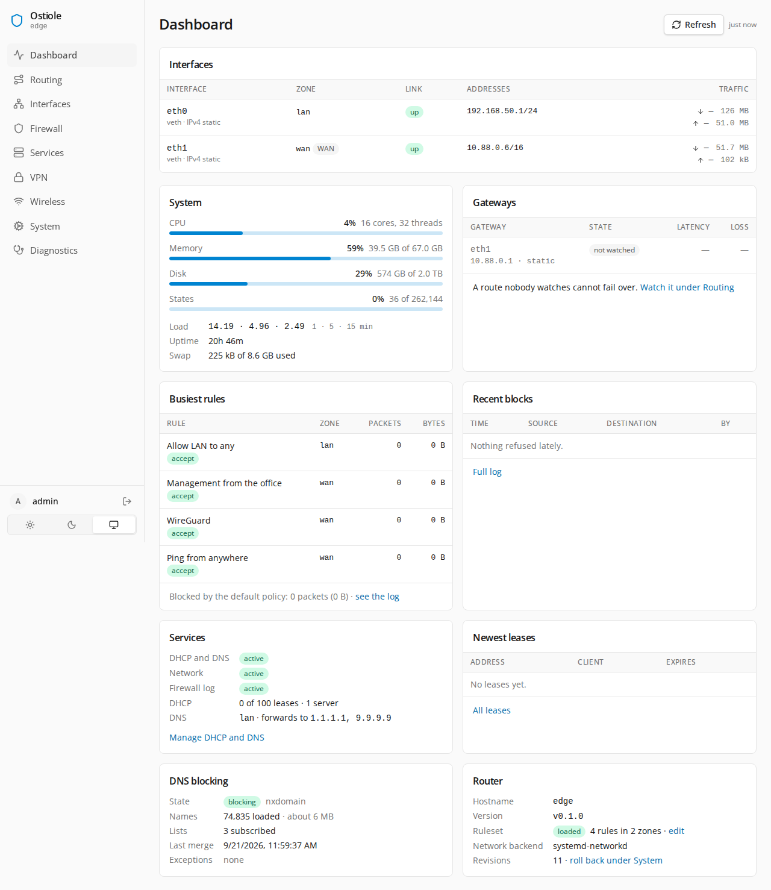
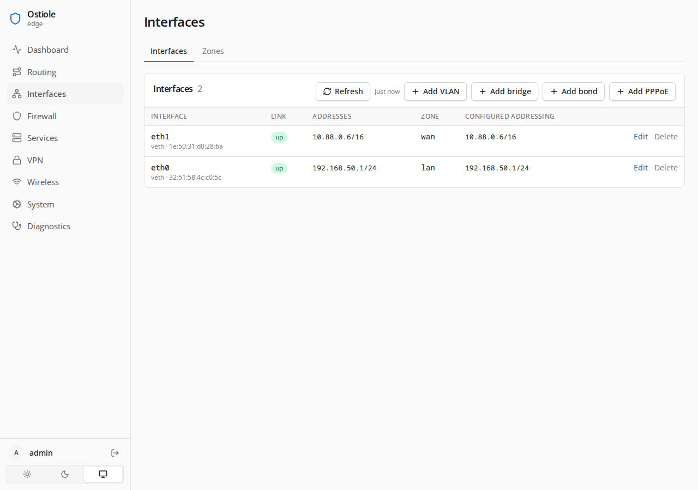
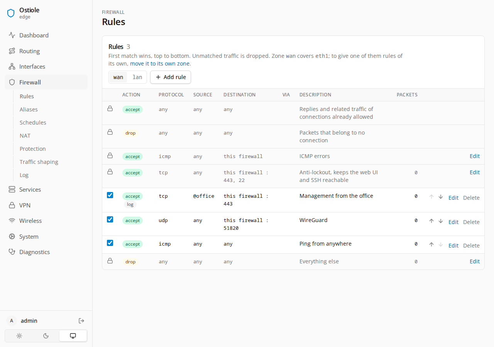
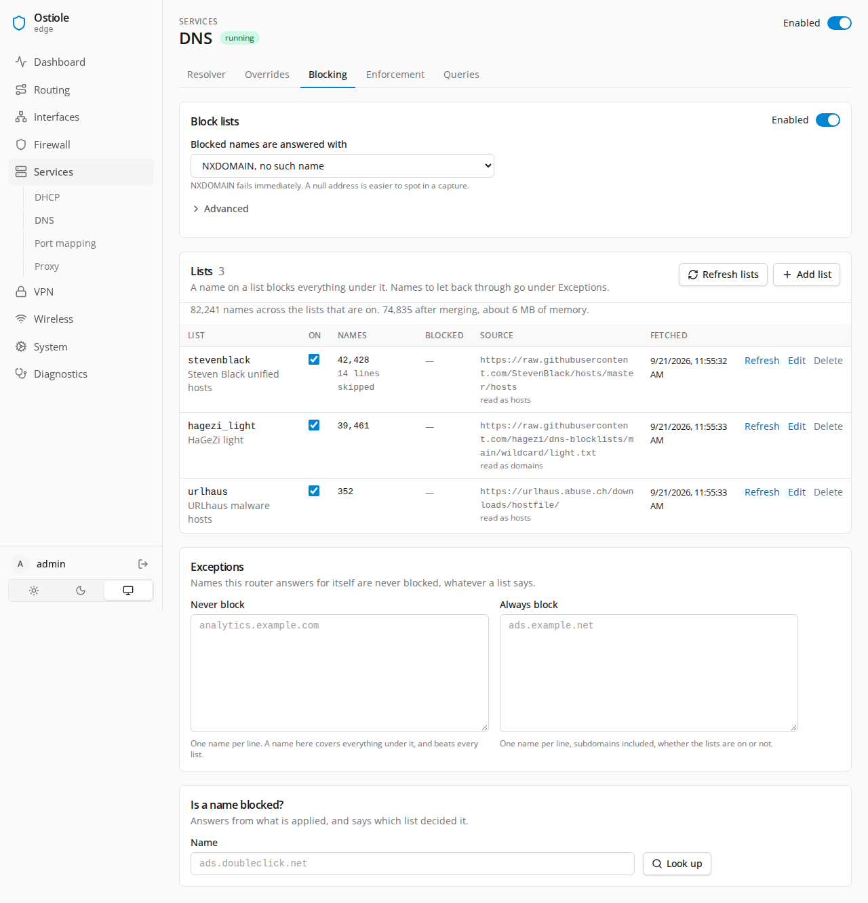
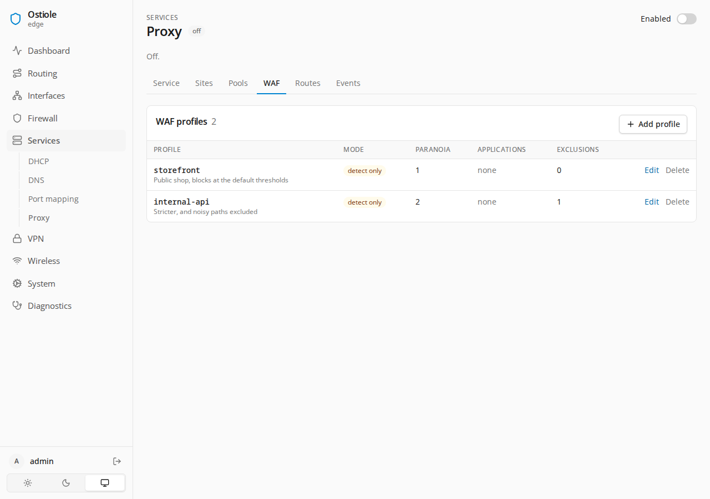
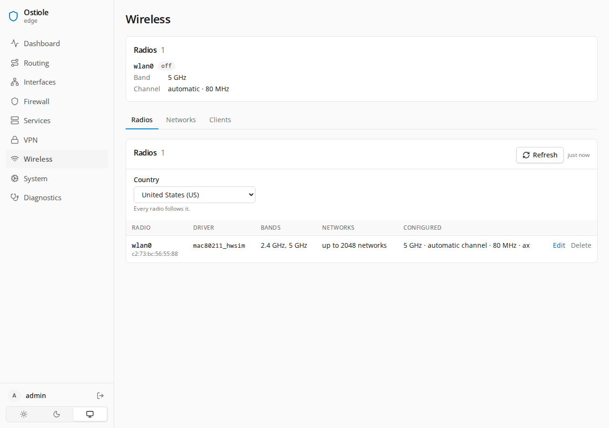
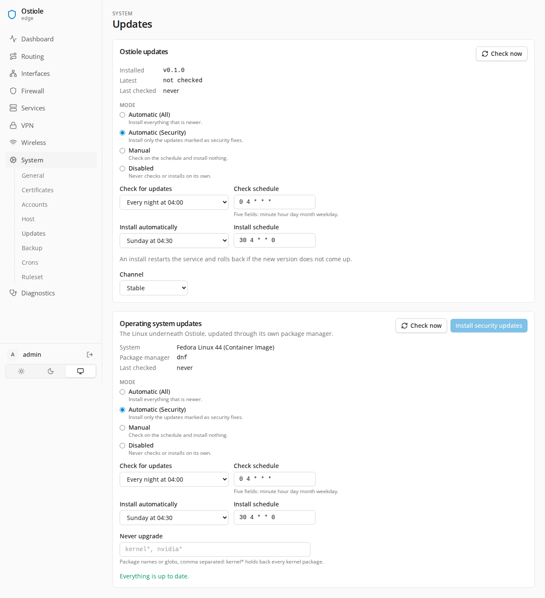
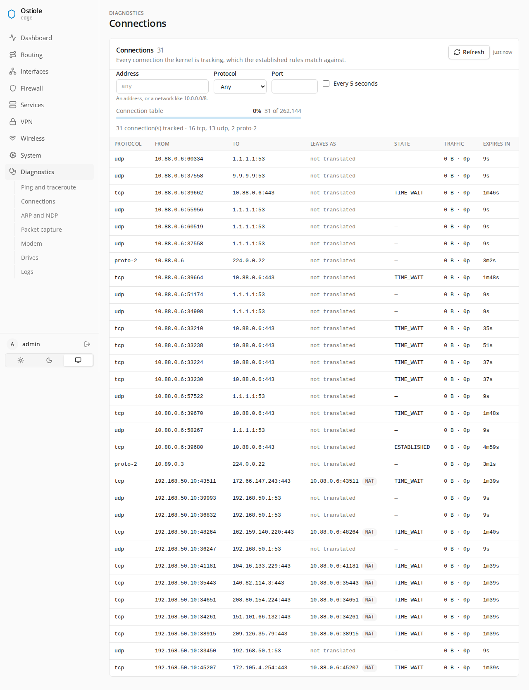

<p align="center"></p>
<h1 align="center">Ostiole</h1>
<p align="center">A firewall and router appliance for Linux, managed from a web UI.</p>
<p align="center">
  <a href="https://github.com/rforced/ostiole/actions/workflows/ci.yml"></a>
  <a href="https://github.com/rforced/ostiole/releases/latest"></a>
  <a href="LICENSE"></a>
</p>

Ostiole turns a Linux machine into a firewall and router. One static binary, a web UI, nftables
underneath, and the usual daemons — systemd-networkd, dnsmasq, unbound, miniupnpd, pppd, chrony —
driven from a single configuration.

**Status:** It works. Expect bugs, and expect the config format to change between releases.

- **Firewall** — zones, rules with aliases (addresses, ports, URL feeds in text or JSON, countries,
  AS numbers) and schedules, NAT, rate limits, a live log.
- **Interfaces** — physical, VLAN, bridge, bond, PPPoE, WireGuard. Static or DHCP, IPv4 and IPv6.
- **Routing** — static routes, multi-WAN with gateway monitoring, policy routing per rule.
- **Services** — DHCP and DNS through dnsmasq and unbound, DNS block lists, UPnP and NAT-PMP,
  time from the NTP Pool through chrony, served to the LAN, and Wake on LAN.
- **Reverse proxy** — publish what is behind the router: hostnames, a certificate it already holds,
  a pool of health-checked backends, and a web application firewall supporting blocking or detection 
  only modes. TCP and UDP pass straight through by port or by the name.
- **Shaping** — a line speed per interface, CAKE queues, priority set by rule.
- **Operations** — commit-confirmed applies that revert themselves, config revisions, backup and
  restore, encrypted copies to S3, API tokens, packet capture, drive health.
- **Updates** — Ostiole updates itself from signed releases and keeps the distribution patched, on a
  schedule you set.

<table>
<tr>
<td width="25%"><a href=".github/screenshots/dashboard.png"></a><br>Dashboard</td>
<td width="25%"><a href=".github/screenshots/interfaces.png"></a><br>Interfaces</td>
<td width="25%"><a href=".github/screenshots/rules.png"></a><br>Firewall rules</td>
<td width="25%"><a href=".github/screenshots/dns-blocking.png"></a><br>DNS blocking</td>
</tr>
<tr>
<td width="25%"><a href=".github/screenshots/proxy-waf.png"></a><br>WAF profiles</td>
<td width="25%"><a href=".github/screenshots/wireless.png"></a><br>Wireless</td>
<td width="25%"><a href=".github/screenshots/updates.png"></a><br>Updates</td>
<td width="25%"><a href=".github/screenshots/connections.png"></a><br>Connections</td>
</tr>
</table>

## Requirements

- **Linux 5.14 or newer**, x86-64 or arm64. That is RHEL 9's kernel; nothing in the ruleset needs
  anything newer.
- **systemd.** The install script brings the rest: nftables, systemd-networkd, dnsmasq, unbound,
  miniupnpd, ppp, tc, chrony.
- **A machine that is the router.** Ostiole runs as root, takes over networking and the firewall,
  and removes what it replaces. Don't run it on your workstation.

The installer refuses an older kernel; `OSTIOLE_IGNORE_KERNEL=1` overrides that. A router that boots
onto an old kernel later keeps filtering and says so on the dashboard.

## Install

On the machine that will be the router:

```sh
curl -fsSL https://github.com/rforced/ostiole/releases/latest/download/install.sh | sudo sh
```

It prints the plan and waits for a yes. The plan: install the packages, download the release and
check its checksum and signature, write the units, load a bootstrap ruleset, hand addressing to
systemd-networkd keeping the addresses the machine already has, keep the time with chrony in place
of the distribution's time service, then remove the firewalls, network managers and desktop services
a router has no use for — firewalld, ufw, NetworkManager, netplan, unattended-upgrades, snapd.

- `--dry-run` prints the plan and stops.
- `--yes` agrees in advance, for provisioning: `curl -fsSL … | sudo sh -s -- --yes`
- `--keep <package>` spares a package from removal. Repeatable.
- `--with-tailscale` installs tailscaled, from Tailscale's repository where a distribution packages
  none.
- `--with-wireless` installs hostapd, iw and the card's firmware. A router with a wifi card gets
  them anyway.
- `--with-proxy` installs the reverse proxy beside the binary.
- `--no-verify` skips the signature check, for a mirror without `checksums.txt.sig` or a machine
  without OpenSSL 3. The checksum is still checked.
- `OSTIOLE_VERSION=v0.1.0` pins a release.

Then open `https://<host>:9443/`, create the admin account, and run the wizard to pick WAN and LAN. Until
that first apply is confirmed the router forwards nothing.

Everything in the UI is on the CLI too:

- `ostiole status` — configuration and kernel state.
- `ostiole check` — validate the configuration and dry-run the ruleset through nft.
- `ostiole apply` — load it, with a confirmation window.
- `ostiole backup`, `restore`, `diff` — the configuration in and out as JSON.
- `ostiole users` — accounts and roles. `reset-password` gets you back in.
- `ostiole update` — check for and install a newer release.
- `ostiole repair` — re-run the install script with the binary already in place. For a router whose
  packages were changed by hand, or an install whose session dropped.
- `ostiole uninstall` — stop the service, remove the units and the `inet ostiole` table. It does not
  put back what the script removed.

`ostiole --help` has the rest.

## Wireless

A card in the router can serve the wifi, with Ostiole driving hostapd. This is the part most likely
not to work on your hardware. Every radio reports its own set of bands, channels, widths and
interface modes, and the drivers disagree about what they will actually let you do — Intel cards
will not serve 6 GHz whatever the card claims, to pick one. What the UI offers you is read off the
card at runtime, so a card nobody has tried yet can come out with the wrong options, or none.

It is developed against an Intel AX210. If yours does not work, open an issue and paste the output
of:

```sh
iw phy                                    # bands, channels, modes, capabilities
lspci -nnk | grep -A3 -i net              # or lsusb; names the card and its driver
uname -r
iw reg get
rfkill list
dmesg | grep -iE 'firmware|iwlwifi|ath|mt76|rtw'
```

`iw phy` is the one that matters — that dump is what support for a card is written from. The rest
explains why it is behaving the way it is.

## Privacy and security

Both come first, in the design and in the defaults. You can loosen either one; you just have to mean
it.

The router keeps as little as it can. DNS queries are never logged at any level, leases only if you
ask for them. The journal is the only log, capped at 10 GB and 90 days. The WAN tells your provider
no hostname, and its IPv6 address carries no hardware address. DNS rebinding is refused, and in
validating mode the root zone is served locally, so no lookup reaches a root server.

What leaves the machine by default: your distribution's mirrors, GitHub's release feed, and whatever
lists you subscribed to. A certificate authority and a DNS provider hear from you only once you ask
for a certificate. Both update checks can be switched off. Nothing is reported to Ostiole; there is
nowhere for it to go. The UI serves no third-party assets and its CSP is `self` only.

Ostiole owns one nftables table, `inet ostiole`, and never flushes another. Applies that could lock
you out are commit-confirmed — they revert on their own unless you confirm from the UI. Releases are
signed, and the installer checks the signature before it runs anything.

It runs as root and it is the firewall, so report vulnerabilities privately through
[Report a vulnerability](https://github.com/rforced/ostiole/security/advisories/new), not in an
issue. [SECURITY.md](SECURITY.md) has the scope and how to verify a release.

## Support the developer

Ostiole is free and stays that way. If you're buying hardware for it anyway, the links below are
affiliate links — same price to you, a small cut to me.

- [BOSGAME E5 11 Pro](https://link.amazon/B02T4arYN) — Ryzen 5300U, 8 GB, 256 GB, dual 2.5 GbE. A
  solid small box to run this on.
- [VNOPN fanless appliance](https://link.amazon/B0aRrJ3Kl) — J3710, 8 GB, 128 GB, four 2.5 GbE i226
  ports. No fan, and more ports than two.
- [Sharevdi fanless appliance](https://link.amazon/B0eGjIZTm) — N3700, 8 GB, 128 GB, six 2.5 GbE
  i226-V ports.
- [Intel AX210](https://link.amazon/B0ff4oIUy) — M.2 Wi-Fi 6E card. See [Wireless](#wireless).

## License

[AGPL-3.0-or-later](LICENSE).

## AI

Most of the code was written by a variety of AI models. The architecture, the decisions,
the review and the testing will continue to be done by me. I run it on my own network and
will continue to do so for my commitment to the project.
