<p align="center"></p>
<h1 align="center">Ostiole</h1>
<p align="center">A firewall and router appliance for Linux, managed from a web UI.</p>
<p align="center">
  <a href="https://github.com/rforced/ostiole/actions/workflows/ci.yml"></a>
  <a href="https://github.com/rforced/ostiole/releases/latest"></a>
  <a href="LICENSE"></a>
</p>

Ostiole turns a Linux machine into a firewall and router. It is one static binary with the web UI
built in. It writes an nftables ruleset and runs the distribution's own daemons from one
configuration: systemd-networkd, dnsmasq, unbound, chrony, miniupnpd, pppd and hostapd.

## Features

- **Firewall:** zones and rules; aliases for addresses, ports, countries, AS numbers and URL feeds
  in text or JSON; schedules; port forwards, outbound NAT (automatic, hybrid or manual), 1:1 NAT
  and NAT reflection; flood and port scan protection; rate limits per rule; a live log.
- **Interfaces:** Ethernet, VLANs, bridges, bonds and PPPoE. IPv4 static or DHCP. IPv6 static,
  SLAAC or DHCPv6 with prefix delegation, and LANs numbered from the delegated prefix. MTU and MAC
  address per interface.
- **Routing:** static routes, monitored gateways, WAN failover through gateway groups, policy
  routing per rule, and answers sent back out of the WAN a connection came in on.
- **DHCP and DNS:** DHCP for IPv4 and IPv6, router advertisements and static leases. DNS forwarded
  in the clear or over TLS, or resolved recursively. Host and domain overrides, DHCP client names
  in DNS, block lists with allow and block exceptions. Clients that use another resolver can be
  redirected or blocked. A query log kept in memory, off by default.
- **Other services:** UPnP, NAT-PMP and PCP; NTP from the NTP Pool or servers you choose, NTS
  optional, served to the LAN; dynamic DNS through Cloudflare; Wake on LAN.
- **Reverse proxy:** Caddy and Coraza, installed with `--with-proxy`. It publishes sites behind the
  router by hostname, with the router's certificates, pools of health-checked backends, an access
  list, and a web application firewall (OWASP Core Rule Set) that blocks or only detects. TCP and
  UDP pass straight through by port, or by server name for TLS.
- **Traffic shaping:** CAKE with a line speed per interface, priority by rule, and a lower priority
  for a host with too many connections. A live view of the queues.
- **VPN:** WireGuard tunnels. Tailscale, with subnet routes, the router as an exit node, and your
  own control server.
- **Wireless:** an access point on a wifi card in the router. See [Wireless](#wireless).
- **Certificates:** from Let's Encrypt or another ACME CA, by HTTP-01 or DNS-01 (RFC 2136,
  Cloudflare, Hetzner, Porkbun, Route 53 or a program of your own), or uploaded.
- **Operations:** applies that revert unless you confirm them, configuration history with diffs,
  backup and restore, encrypted copies to an S3 bucket on a schedule, cron jobs, and notifications
  by email or webhook (Slack, Discord, ntfy).
- **Accounts and API:** admin, operator and viewer roles, API tokens, an OpenAPI description
  and Prometheus metrics.
- **Updates:** Ostiole updates itself from signed releases and puts the old release back if the
  new one does not start. The reverse proxy takes the new release's configuration on its own. What
  else a release renders differently waits for an apply, which the UI offers. The distribution's
  packages update on a schedule you set, all of them or only security fixes.
- **Diagnostics:** ping and traceroute, the connection table, ARP and NDP, the rendered ruleset,
  packet capture, the journal, drive health from SMART, and a Hitron cable modem's status.
- **Web UI:** a setup wizard, a dashboard, light and dark themes, and a layout for phones.

<table>
<tr>
<td width="25%"><a href=".github/screenshots/dashboard.png">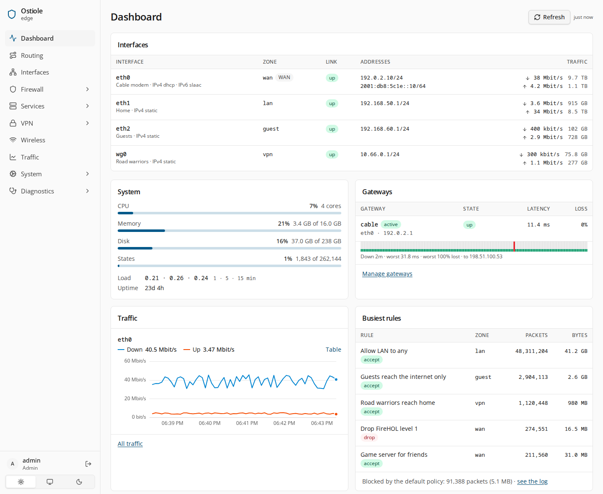</a><br>Dashboard</td>
<td width="25%"><a href=".github/screenshots/dns-blocking.png">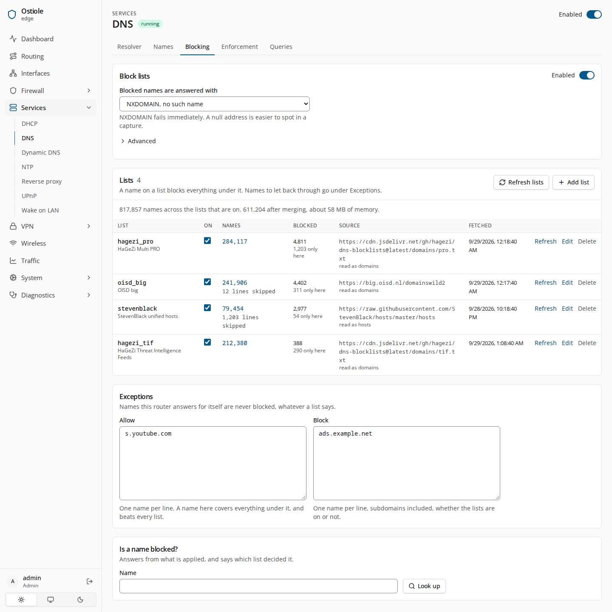</a><br>DNS blocking</td>
<td width="25%"><a href=".github/screenshots/proxy.png">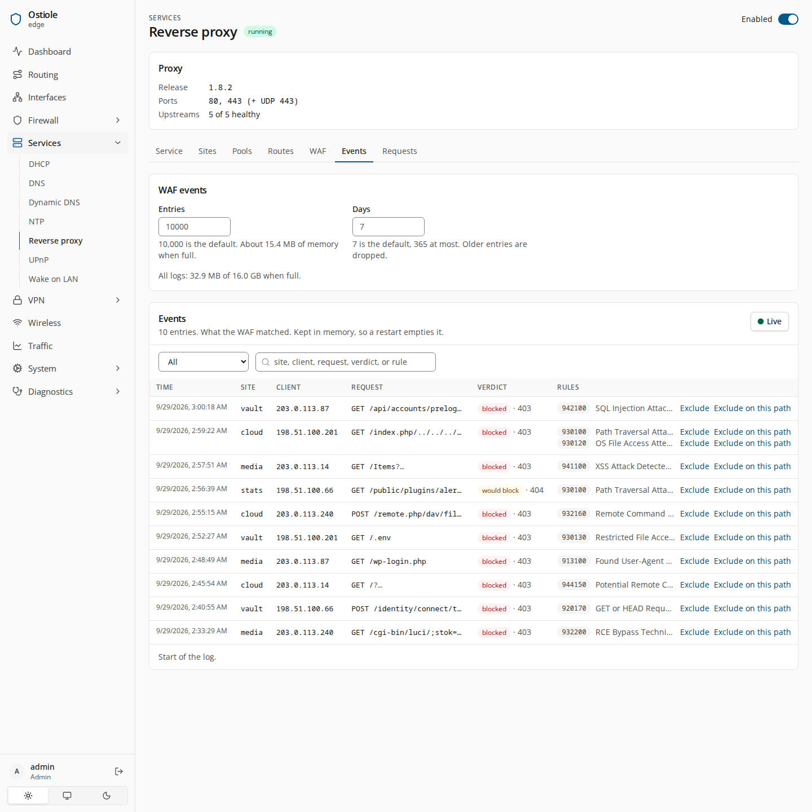</a><br>Reverse proxy</td>
<td width="25%"><a href=".github/screenshots/rules.png">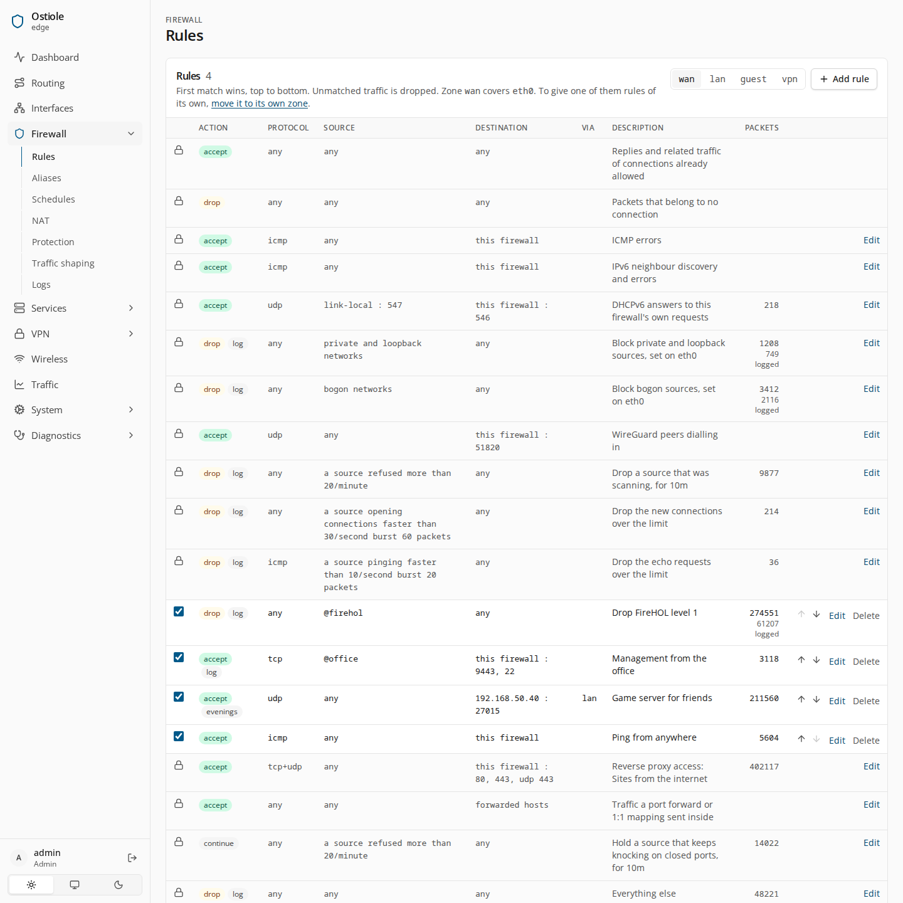</a><br>Firewall rules</td>
</tr>
<tr>
<td width="25%"><a href=".github/screenshots/traffic.png">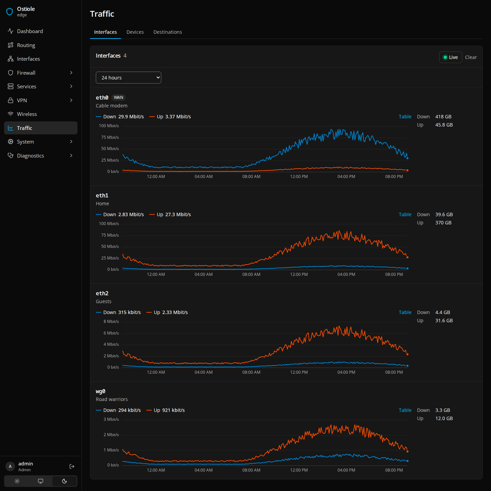</a><br>Traffic</td>
<td width="25%"><a href=".github/screenshots/firewall-log.png">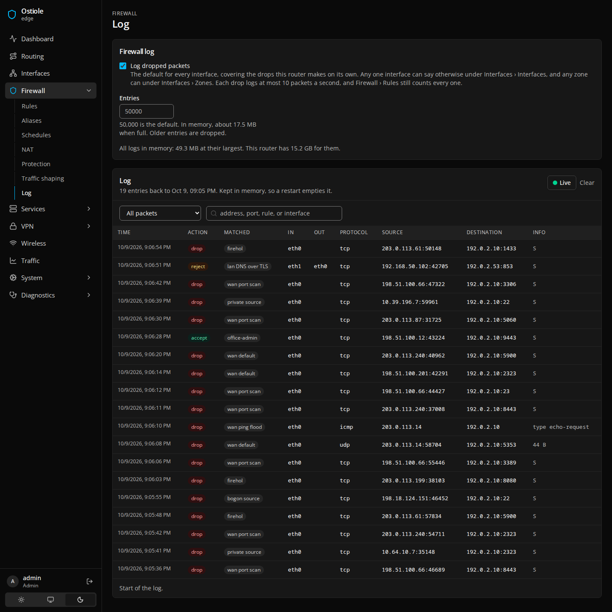</a><br>Firewall log</td>
<td width="25%"><a href=".github/screenshots/wireguard.png">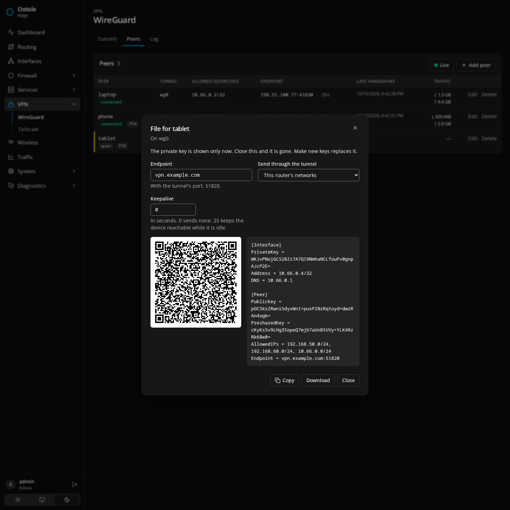</a><br>WireGuard</td>
<td width="25%"><a href=".github/screenshots/shaping.png">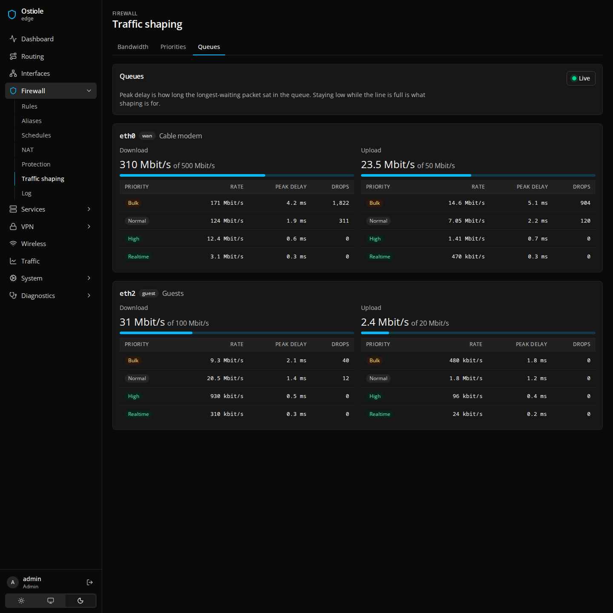</a><br>Traffic shaping</td>
</tr>
<tr>
<td width="25%"><a href=".github/screenshots/mobile-dashboard.png">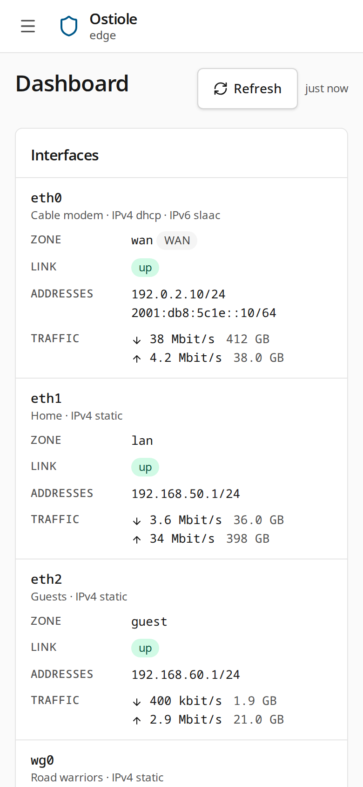</a><br>Dashboard on a phone</td>
<td width="25%"><a href=".github/screenshots/mobile-navigation.png">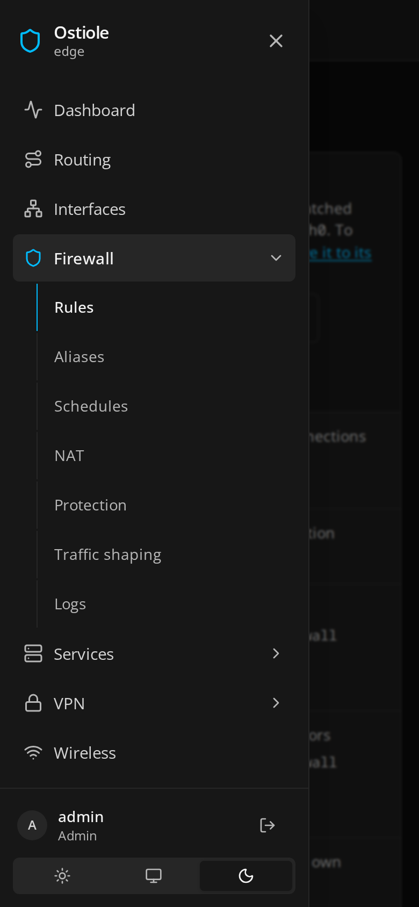</a><br>Navigation</td>
<td width="25%"><a href=".github/screenshots/mobile-rules.png">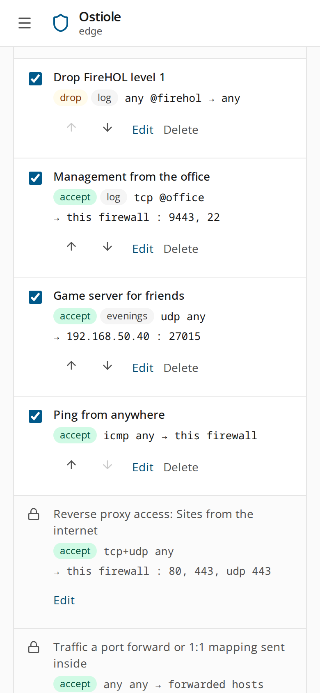</a><br>Rules on a phone</td>
<td width="25%"><a href=".github/screenshots/mobile-traffic.png">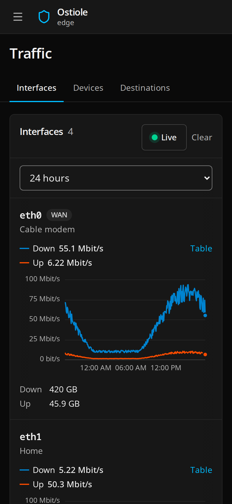</a><br>Traffic on a phone</td>
</tr>
</table>

## Requirements

- **Linux 6.12 or newer** (the kernel of Debian 13 and Rocky Linux 10), x86-64 or arm64.
- **systemd.** The install script installs the rest: nftables, systemd-networkd, dnsmasq, unbound,
  chrony, miniupnpd, ppp, tc and smartmontools.
- **1 GB of RAM.** Large DNS block lists (about 100 MB per million names) and the reverse proxy
  with WAF profiles (about 100 MB) need more. The logs kept in memory are capped by what the
  router has left, and each log's page says how many entries this router allows.
- **A machine that is only the router.** Ostiole runs as root, takes over networking and the
  firewall, and removes what it replaces. Do not run it on your workstation.

The installer refuses an older kernel; `OSTIOLE_IGNORE_KERNEL=1` overrides that. A router that
later boots an older kernel keeps filtering and says so on the dashboard.

## Distributions

CI installs Ostiole on each of these on every push:

- Debian 13
- Ubuntu 26.04
- Fedora 44
- Rocky Linux 10
- Arch Linux

Where they differ:

- **Arch:** OS updates default to Manual, because Arch has no security-only updates. Wireless
  networks cannot use Enhanced open, because Arch builds hostapd without OWE. The network dialog
  greys it out, and an apply that asks for it is refused.
- **Debian:** the NTP page cannot show whether NTS works or how many requests were served, because
  chrony 4.6 does not report them. Wifi firmware is in the non-free-firmware section. Debian's
  installer enables it on most machines; on a cloud image, add it and run `ostiole repair`.
- **Where UPnP and Tailscale come from:** Arch builds miniupnpd from the AUR during the install and
  removes the build tools afterwards. Each release pins the AUR commit it reviewed and carries
  miniupnp's signing key, so a changed recipe, source or package is not installed. Rocky Linux uses
  Fedora's miniupnpd package. Debian, Ubuntu and Rocky Linux get Tailscale from Tailscale's own
  repository.

## Install

On the machine that will be the router:

```sh
curl -fsSL https://github.com/rforced/ostiole/releases/latest/download/install.sh | sudo sh
```

The script prints its plan and waits for a yes. The plan:

1. Install the packages a router needs.
2. Download the release and check its checksum and signature.
3. Write the systemd units and load a bootstrap ruleset that forwards nothing.
4. Hand addressing to systemd-networkd, keeping the addresses the machine has now.
5. Keep the time with chrony in place of the distribution's time service.
6. Remove the firewalls, network managers, updaters and desktop services a router has no use for:
   firewalld, ufw, NetworkManager, netplan, unattended-upgrades, snapd and the like.

Options:

- `--dry-run` prints the plan and stops.
- `--yes` agrees in advance, for provisioning: `curl -fsSL … | sudo sh -s -- --yes`
- `--keep <package>` spares a package from removal. Repeatable.
- `--with-tailscale` installs tailscaled, from Tailscale's repository where the distribution has
  no package.
- `--with-wireless` installs hostapd, iw and the card's firmware. A router with a wifi card gets
  them anyway.
- `--with-proxy` installs the reverse proxy beside the binary.
- `--no-verify` skips the signature check, for a mirror without `checksums.txt.sig` or a machine
  without OpenSSL 3. The checksum is still checked.
- `--listen :8443` serves the web UI on another port. The default is 9443.
- `--timezone Europe/Berlin` sets the time zone. The default is UTC. `--timezone -` leaves it as
  it is.
- `OSTIOLE_VERSION=v1.6.1` pins a release: `curl -fsSL … | sudo OSTIOLE_VERSION=v1.6.1 sh`

Then open `https://<host>:9443/` and create the admin account right away: until one exists,
anyone who reaches the port can create it. Run the wizard to pick the WAN and LAN. The router
forwards nothing until that first apply is confirmed.

Two steps can cut off the session you install from:

- **The handover to systemd-networkd.** It is the install's last step, and the old network
  manager is removed once it holds. The install waits about 20 seconds for every address to come
  back. If one does not, the previous network manager returns after three minutes unless
  `ostiole takeover --network --confirm` runs. If the SSH session drops, reconnect and confirm:
  that finishes the install. If you cannot reconnect, wait: the old manager comes back with the
  old addresses.
- **The first apply.** Anti-lockout keeps the web UI and SSH open from the LAN only. If you manage
  the router over its public address, tick "Allow management from the WAN side too" in the
  wizard. Otherwise the apply cuts you off, is never confirmed, and reverts on its own.

At the console, or over SSH from the LAN:

- `ostiole reset-password` sets a new password for admin.
- `ostiole revisions` lists earlier configurations, newest first. `ostiole apply --revision <id>`
  loads one, with a confirmation window.
- `ostiole takeover --network --revert` hands addressing back to the previous network manager, if
  it is still installed.

The same binary is the command line:

- `ostiole status`: the configuration and the kernel's state, and what an apply would change
  (`--changes` lists the lines).
- `ostiole check`: validate the configuration and dry-run the ruleset through nft.
- `ostiole apply`: load it, with a confirmation window.
- `ostiole backup`, `restore`, `diff`: the configuration in and out as JSON.
- `ostiole users`: accounts and roles. `reset-password` gets you back in.
- `ostiole update`: check for and install a newer release.
- `ostiole repair`: rerun the install script with the binary in place, for a router whose packages
  were changed by hand or an install whose session dropped.
- `ostiole uninstall`: stop and remove Ostiole's units (the daemon, the firewall and every service
  it runs) with their drop-ins, the configuration they read under /etc, the sysctl, modprobe,
  journald and sysusers files, the networkd units, shaping, policy routing and the `inet ostiole`
  table; hand the network back if the old manager is still installed; and unmask the
  distribution's units Ostiole masked to run its own (its resolver, unbound, miniupnpd, tailscaled,
  hostapd, time services, bluetooth and update timers) without starting them. `--purge` also
  removes /etc/ostiole, the log files, the services' state (proxy certificates, Tailscale's node,
  DHCP leases), the `ostiole` and `ostiole-proxy` binaries and the `ostiole-proxy` account. The
  backups in /var/backups/ostiole stay. Packages the script removed are not reinstalled, and
  competitors it masked stay masked.

`ostiole --help` lists the rest.

## Wireless

A wifi card in the router can run an access point through hostapd. It is developed on an Intel
AX210, on 2.4 and 5 GHz. 6 GHz and radar channels are not supported, so there is no 160 MHz. The UI
offers what the card reports, and drivers differ in what they allow, so a card nobody has tried may
show the wrong options or none.

If yours does not work, open an issue with the output of:

```sh
iw phy
lspci -nnk | grep -A3 -i net    # or lsusb
uname -r; iw reg get; rfkill list
dmesg | grep -iE 'firmware|iwlwifi|ath|mt76|rtw'
```

## Privacy and security

- No telemetry. The UI loads nothing from third parties.
- By default the router contacts your distribution's mirrors, GitHub for Ostiole releases, the NTP
  Pool, and Quad9 for DNS, unencrypted until you choose DNS over TLS. Anything else starts when you
  set it up. Both update checks can be turned off.
- DNS queries and DHCP leases are not logged by default. The journal is the only log, capped at
  10 GB and 90 days.
- The WAN sends your provider no hostname, and its IPv6 address does not contain the hardware
  address.
- Ostiole's rules live in one nftables table, `inet ostiole`.
- An apply that could lock you out reverts unless you confirm it.
- Releases are signed, and the installer and the updater check the signature.

Report vulnerabilities privately through
[Report a vulnerability](https://github.com/rforced/ostiole/security/advisories/new), not in an
issue. [SECURITY.md](SECURITY.md) has the scope and how to verify a release.

## Support the developer

Ostiole is free and stays that way. If you are buying hardware for it, the links below are
affiliate links: the same price for you, a small cut for me.

- [BOSGAME E5 11 Pro](https://link.amazon/B02T4arYN): Ryzen 5300U, 8 GB, 256 GB, two 2.5 GbE
  ports.
- [VNOPN fanless appliance](https://link.amazon/B0aRrJ3Kl): J3710, 8 GB, 128 GB, four 2.5 GbE i226
  ports.
- [Sharevdi fanless appliance](https://link.amazon/B0eGjIZTm): N3700, 8 GB, 128 GB, six 2.5 GbE
  i226-V ports.
- [Intel AX210](https://link.amazon/B0ff4oIUy): M.2 wifi card, the one the wireless support is
  developed on. See [Wireless](#wireless).

## License

[AGPL-3.0-or-later](LICENSE).
